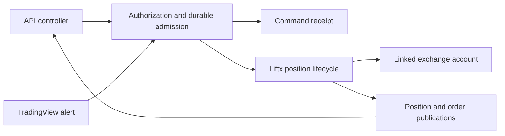

Liftx connects trading automation to the same position, order, and protection lifecycle used by the Liftx terminal. Use the API for a controller that reads live state, or TradingView webhooks for signals from charts, indicators, and Pine scripts.

<Info>
API v1 and TradingView are documented for integration preparation. Production activation and complete live TradingView validation are pending. Check [availability](/availability) before creating an active trading workflow. MCP is planned and has no active endpoint.
</Info>

<CardGroup cols={2}>
  <Card title="API" icon="code" href="/api/overview">
    Discover accounts and instruments, read positions, submit durable commands, and reconcile results.
  </Card>
  <Card title="TradingView" icon="chart-line" href="/integrations/tradingview/overview">
    Set up a restricted key, copy JSON into ordinary alerts, or build a Pine signal producer.
  </Card>
  <Card title="First integration" icon="rocket" href="/getting-started">
    Choose an access method, understand units, and follow a controlled demo validation sequence.
  </Card>
  <Card title="MCP · Planned" icon="plug" href="/mcp/overview">
    Learn what is planned for ChatGPT and Claude, without configuring an unavailable server.
  </Card>
</CardGroup>

## One trading model

An authenticated exchange link selects the account and registered exchange adapter. An instrument identifier comes from that account's catalog. Requests do not guess the venue from a ticker or use a default exchange.

A position contains OPEN orders and its configured SL, SLx, and TP protections. An external command delegates to Liftx's existing execution owners. Attached orders and protections are part of this position model; the integration does not create a second order engine.

## Acceptance and execution are different

An HTTP `202` means a command was durably accepted. It does not mean that an order filled, a modification finished, or exposure is flat. Track the receipt, then read the position and orders. Uncertain work remains explicitly uncertain; sending a new command identity after a timeout can create a second intent.

TradingView sends signals in one direction. Pine cannot query Liftx positions through an arbitrary HTTP request, and it cannot use a webhook response as execution feedback. Strategies that need authoritative position state should use an API controller.

## Access and examples

API and TradingView access are included with Pro and the trial, without usage metering. Bounded concurrency, queue capacity, security controls, and exchange limits still apply. Account and instrument permissions remain independent from subscription access.

Every credential, account identifier, position UUID, price, and quantity in these docs is illustrative. Obtain the exact catalog identity and account scope from Liftx, choose your own validated size and price, and begin with an authorized demo account. No example is an investment recommendation or a complete production strategy.

The [OpenAPI document](/api/openapi.json) defines the published HTTP contract. The [position request guide](/api/position-request) explains the fixed-point trading payload. The [security guide](/security) covers credential handling and revocation.
